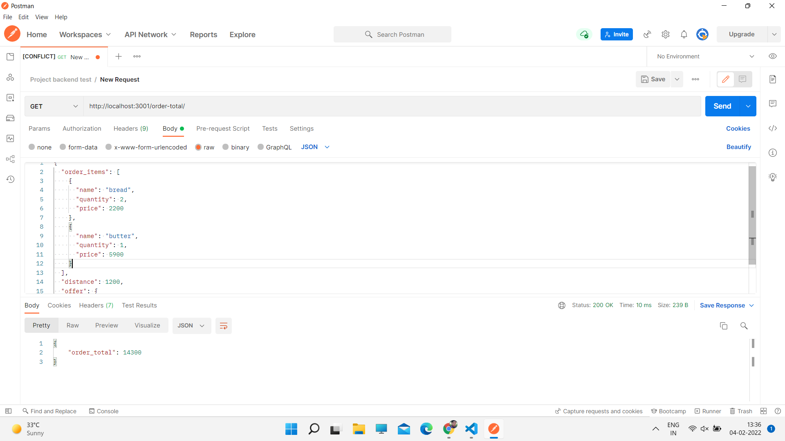
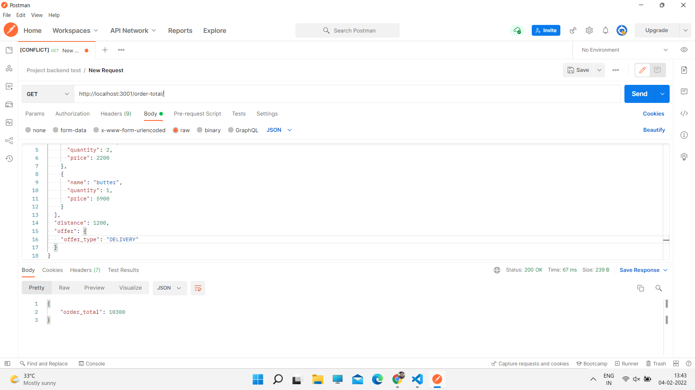
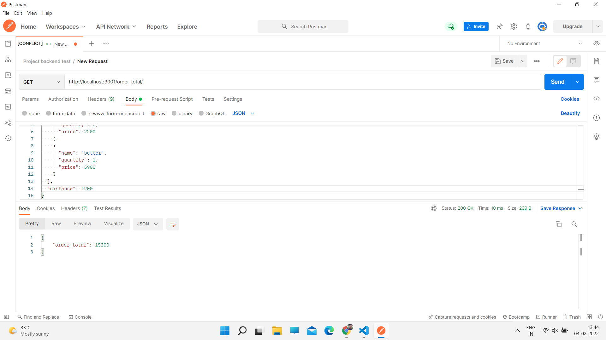

# NodeJS Backend API for Total Order Calculation

## Description 
This is an API for calculation Total Order Cost with the given Order details and it is built using NodeJS and Express by LAVAN KUMAR CH.

# Pre-requisites
- Install [Node.js](https://nodejs.org/en/) version 14.0.0 and above


# Getting started
- Clone the repository
```
git clone https://github.com/lavank179/order-api.git
```
- Install dependencies
```
cd order_api
npm install
```
- Build and run the project
```
npm start
```
  Navigate to `http://localhost:3001/order-total/`

- API Document endpoints

  total Order Calculation : http://localhost:3001/order-total/

  home Page : http://localhost:3001/


# Understanding Code Structure
## Files
- *app.js*                - root file where application and server starts.

- *orderCalculate.js*     - contains following methods

      `OrderTotal`        - total order cost calculation

      `calculateDelivery` - delivery cost checking

      `checkTypeFormat`   - verifying whether any type or format errors exists.


# Screenshots with output in POSTMAN
order with FLAT discount


order with DELIVERY discount


order without discount


&copy; All copyrights - LAVAN KUMAR CH.